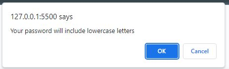
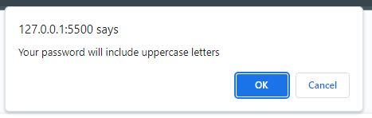
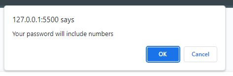
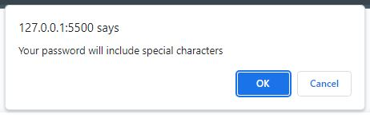

# Password-Generator

A unique password generator

## Description

This webpage contains a password generator. This aim was to create a password generator which uses user input to generate a password which includes lowercase, uppercase, numeric and special characters. Throughout this project, I have developed my understanding of for loops, console.log, if statements and the use of return. Moving forward, I would think of how to change my code to ensure that for every password generated, there is at least one lowercase, uppercase, numeric and special character included. I would also allow users to cancel the password generator when they click the cancel button.

## Installation

To work on this code copy this SSH key: git@github.com:chelsea32568/Password-Generator.git and paste into your desired folder using Git Bash. Then use git pull to pull the file into your local repository. Make necessary changes and then add changes into the git repository by using git add -A, git commit -m "", git push.

## Usage

After opening the HTML file the Password Generator screen appears.

If you click Generate Password a prompt box will appear asking you how many characters you would like your password to be.

If you do not type a numeric value, an error box appears asking you to start again.

If you do not type a number between 8 and 128, and error message occurs asking you to try again.

Once you have selected a number between 8 - 128 confirm boxes will appear stating that your password will include lowercase, uppercase, numeric and special characters.

The password will then be generated.

## Credits

- [Confirm boolean](https://sabe.io/blog/javascript-yes-no-confirmation-box)
- [Random array element](https://stackoverflow.com/questions/5915096/get-a-random-item-from-a-javascript-array)
- [Generate password function] Sean New - Online Tutoring Service
- [Prevent users from entering non-numeric characters] Sean New - Mansi Ask BCS

## License

MIT License

Copyright (c) [2023] [Chelsea Chapman]

Permission is hereby granted, free of charge, to any person obtaining a copy
of this software and associated documentation files (the "Software"), to deal
in the Software without restriction, including without limitation the rights
to use, copy, modify, merge, publish, distribute, sublicense, and/or sell
copies of the Software, and to permit persons to whom the Software is
furnished to do so, subject to the following conditions:

The above copyright notice and this permission notice shall be included in all
copies or substantial portions of the Software.

THE SOFTWARE IS PROVIDED "AS IS", WITHOUT WARRANTY OF ANY KIND, EXPRESS OR
IMPLIED, INCLUDING BUT NOT LIMITED TO THE WARRANTIES OF MERCHANTABILITY,
FITNESS FOR A PARTICULAR PURPOSE AND NONINFRINGEMENT. IN NO EVENT SHALL THE
AUTHORS OR COPYRIGHT HOLDERS BE LIABLE FOR ANY CLAIM, DAMAGES OR OTHER
LIABILITY, WHETHER IN AN ACTION OF CONTRACT, TORT OR OTHERWISE, ARISING FROM,
OUT OF OR IN CONNECTION WITH THE SOFTWARE OR THE USE OR OTHER DEALINGS IN THE
SOFTWARE.

© 2023 edX Boot Camps LLC. Confidential and Proprietary. All Rights Reserved.
